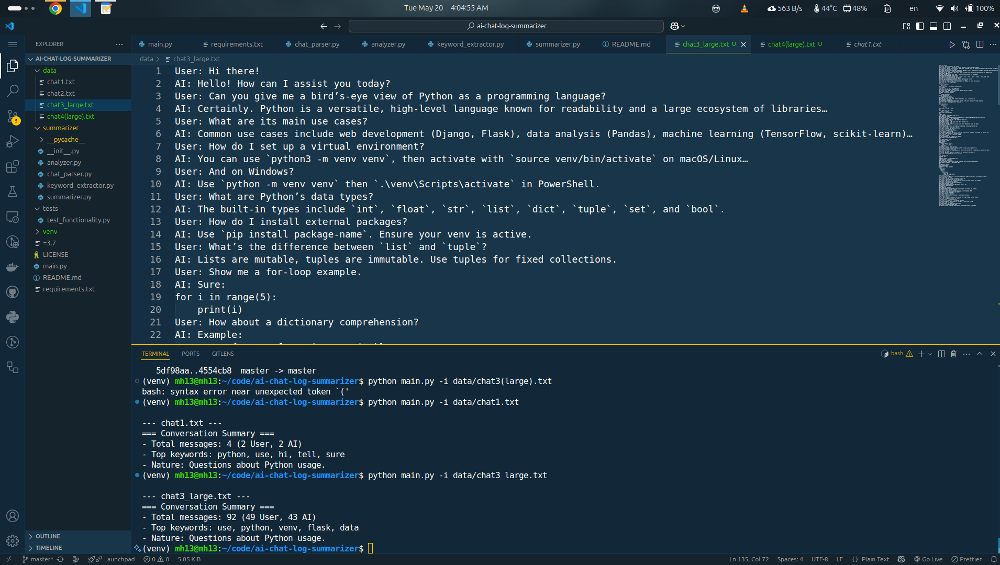
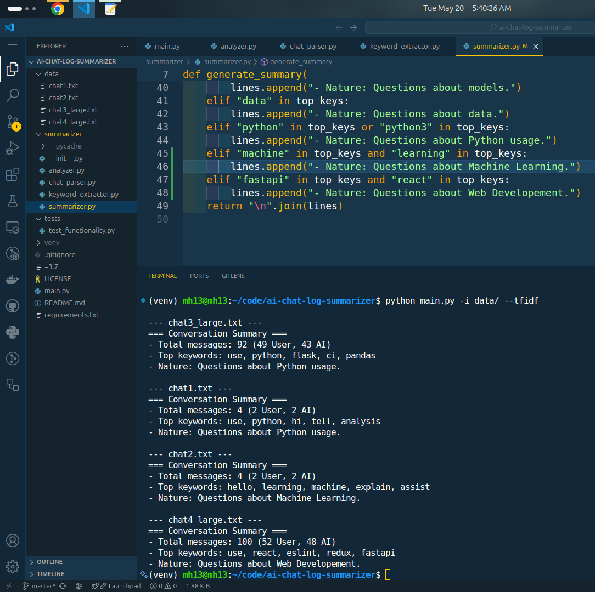

## AI Chat Log Summarizer

A simple, extensible Python CLI tool that:
- **Parses** `.txt` chat logs (lines prefixed with `User:` or `AI:`)  
- **Computes** message statistics (total messages, user vs. AI)  
- **Extracts** top keywords (frequency or optional TF-IDF)  
- **Generates** a concise, human-readable summary  

Perfect for quickly getting the gist of long conversation transcripts.

---

## 🔥 Features

- **Chat Parsing**  
  Reads chat lines, separates speaker and content.

- **Statistics**  
  Counts total messages, plus the breakdown between User and AI.

- **Keyword Extraction**  
  - **Frequency mode** (default): Top-5 non-stopwords  
  - **TF-IDF mode** (`--tfidf`): Highlights more “distinctive” terms

- **Summary Report**  
  Shows message counts, most common keywords, and a simple “nature” insight.

- **Batch Processing**  
  Summarize all `.txt` logs in a folder at once.

---

## 🚀 Quickstart

### 1. Clone & install

```bash
git clone https://github.com/<your-username>/ai-chat-log-summarizer.git
cd ai-chat-log-summarizer

# Create a virtual environment
python3 -m venv venv
# Activate it (macOS/Linux)
source venv/bin/activate
# (Windows PowerShell)
.\venv\Scripts\Activate.ps1

# Install dependencies
pip install -r requirements.txt
```

### 2. Prepare your data

Place your chat files in the `data/` folder. Each file should look like:

```text
User: Hello!
AI: Hi there—how can I help?
User: What is machine learning?
AI: Machine learning is...
```

You can include any number of `.txt` files there (e.g. `chat1.txt`, `chat2.txt`, etc.).

---

## 💻 Usage

### Summarize a single file

```bash
python main.py -i data/chat1.txt
```


### Summarize all files in a folder

```bash
python main.py -i data/
```

### Use TF-IDF for keywords

```bash
python main.py -i data/chat1.txt --tfidf
```

This weights words by how unique they are across messages, rather than just raw counts.

---

#### Sample output

```
--- chat1.txt ---
=== Conversation Summary ===
- Total messages: 8 (5 User, 3 AI)
- Top keywords: python, ai, data, use, language
- Nature: Questions about Python usage.
```

## 📸 Pictures






## 🧪 Testing(Optional)

If you’ve added tests under `tests/`, run:

```bash
pytest -q
```

Make sure your virtual environment is active before running tests.

---

## 📂 Project Structure

```
ai-chat-log-summarizer/
├── data/
│   ├── chat1.txt
│   └── chat2.txt
├── summarizer/
│   ├── __init__.py
│   ├── chat_parser.py
│   ├── analyzer.py
│   ├── keyword_extractor.py
│   └── summarizer.py
├── tests/
│   └── test_functionality.py
├── .gitignore
├── LICENSE
├── main.py
├── README.md
└── requirements.txt
```

* **`data/`** — Your chat logs
* **`summarizer/`** — Core modules (parsing, stats, keywords, summary)
* **`tests/`** — Optional pytest tests
* **`main.py`** — CLI entry point
* **`requirements.txt`** — Library dependencies

---

## 📝 Contributing

1. **Fork** the repo
2. **Branch** for each feature:

   ```bash
   git checkout -b feat-keyword-extraction
   ```
3. **Commit** changes in small, logical increments:

   * `feat: add chat_parser module`
   * `feat: implement message_stats`
   * `feat: add frequency-based keywords`
   * `feat: summary generator`
   * `feat: TF-IDF option`
4. **Push** and open a Pull Request

---

## 📄 License

This project is released under the MIT License. See [LICENSE](LICENSE) for details.

---

## 📫 Contact

Created by **Md. Mehedi Hasan** ([mh13.mehedi.hasan@gmail.com](mailto:mh13.mehedi.hasan@gmail.com))

Feel free to open issues or submit pull requests!
